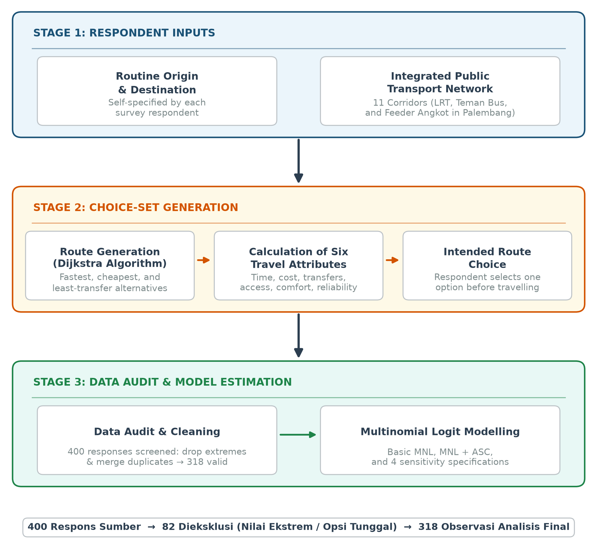
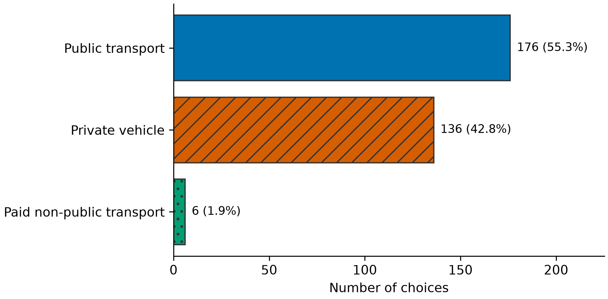
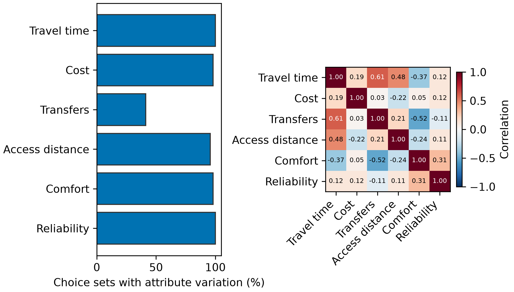
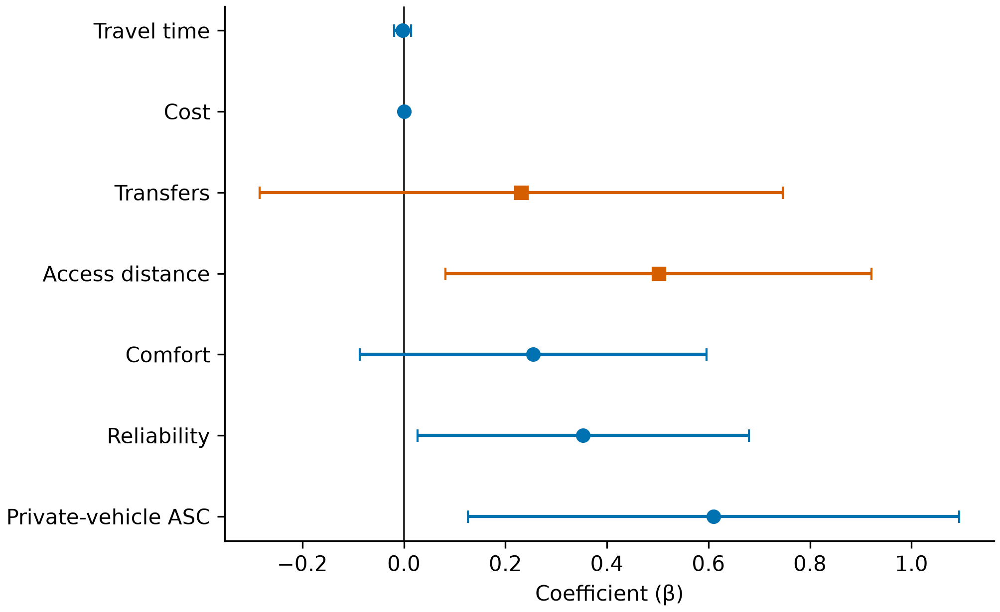
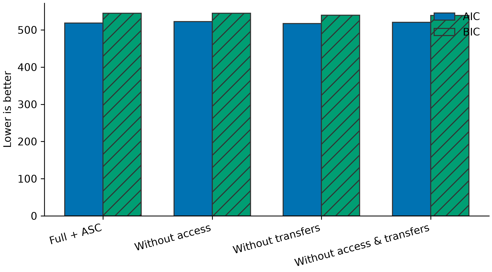
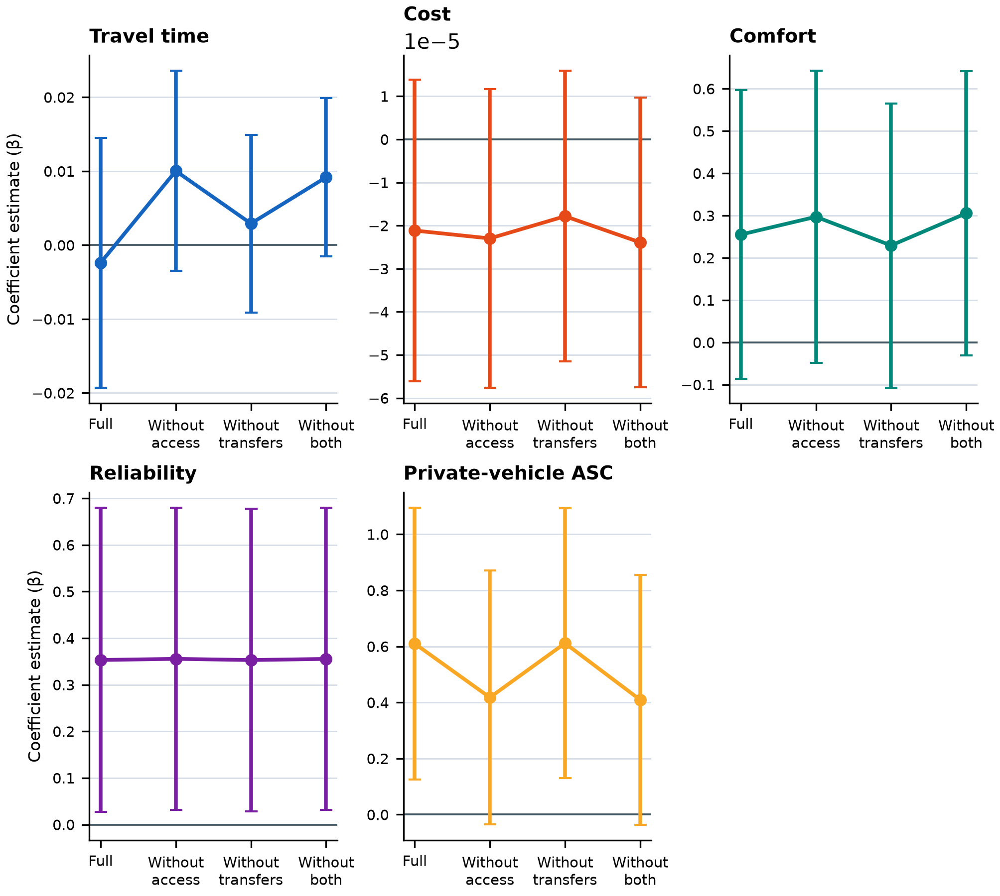

# Mode Choice Modelling in Palembang’s Integrated Public Transport Network Using Multinomial Logit

## ABSTRACT

Service integration does not automatically increase public transport use unless the attributes considered by travellers are understood. This study analyses mode choice within Palembang’s integrated LRT Sumsel, Teman Bus, and Angkot Feeder network using a multinomial logit model. The survey was conducted from 1 August to 16 September 2026 among 400 respondents who lived and routinely travelled in Palembang and knew the available transport options. Each respondent specified an origin and destination for a routine trip; the application then generated public transport, private-vehicle, and paid non-public transport alternatives characterised by travel time, cost, transfers, access distance, comfort, and reliability. Following data auditing, consolidation of identical alternatives, and exclusion of singleton choice sets and extreme values, 318 observations were retained. Adding a private-vehicle alternative-specific constant improved fit over the basic model (McFadden ρ²=0.0514; AIC=518.10). Reliability had a positive significant effect (β=0.353; p<0.05), while the private-vehicle constant was also positive and significant (β=0.610; p<0.05), indicating a baseline inclination towards private vehicles beyond measured attributes. Access distance was positive and significant but contrary to theory and was therefore not interpreted causally. Time, cost, and transfers were insignificant; removing transfers did not significantly reduce model fit (p=0.3790). The findings emphasise service reliability and unobserved preferences, while showing that system-derived attributes and intended choices require validation against operational data and realised travel before the model informs policy recommendations or application personalisation.

**Keywords:** mode choice; multinomial logit; integrated public transport; reliability; Palembang

## INTRODUCTION

Urban public transport must provide connectivity and service quality capable of competing with private vehicles. In Palembang, LRT Sumsel, Teman Bus, and Angkot Feeder form a network that enables intermodal trips. Network availability alone, however, does not explain how users value time, cost, transfers, access, comfort, and reliability when choosing a mode. Behavioural analysis is required so that service integration extends beyond infrastructure provision.

Random utility theory represents choice as a comparison of alternative utilities (McFadden 1974; Ben-Akiva & Lerman 1985). Multinomial Logit (MNL) remains the cornerstone of contemporary mode-choice modelling because it connects choice probabilities directly to travel attributes and permits parameter estimation via maximum likelihood (Train 2009; Zhao et al. 2020). Recent literature indicates that travel time and monetary cost represent primary sources of disutility, whereas operational reliability, service quality, and comfort significantly enhance the attractiveness of public transport options (Eldeeb & Mohamed 2020; Ranjan & Sinha 2024). Moreover, transfer convenience and first-mile/last-mile access distance have consistently been identified as critical determinants governing willingness to shift from private motor vehicles to integrated rail and feeder transit systems (Lu et al. 2023; Ramos-Santiago 2022; Lieu & Akar 2025).

Nevertheless, basic multinomial logit models face well-known challenges in capturing unobserved intrinsic preferences. Travel mode choices are frequently shaped by habits, modal availability, or perceived flexibility that are not fully reflected in service-level variables alone (Zhao et al. 2020; Ranjan & Sinha 2024). Consequently, incorporating alternative-specific constants (ASCs) is essential to disentangle innate modal bias from the marginal utility of measured level-of-service attributes (Ben-Akiva & Lerman 1985; Train 2009). Furthermore, constructing choice sets that reflect realistic, routine travel activities specified by travelers themselves provides a more grounded behavioral context for empirical estimation (Lu et al. 2023).

This study uses a route-search application as an instrument to generate choice sets for respondent-defined routine origin–destination pairs. Dijkstra’s algorithm (Dijkstra 1959) only generates alternatives; the main contribution is the estimation of mode-choice determinants. The objectives are to: (1) describe choices across mode groups; (2) estimate a basic MNL and an MNL with a private-vehicle alternative-specific constant (ASC); and (3) examine robustness through reduced specifications and sample sensitivity.

## METHODOLOGY

### Study Context and Transport Network

The study concerns routine trips in Palembang. The application network includes eight Angkot Feeder corridors, two Teman Bus corridors, and LRT Sumsel. Alternatives are grouped as public transport, private vehicles, and paid non-public transport. The last category includes demand-responsive or hired services outside the public transport network and is not treated as private-vehicle ownership.

### Application-Generated Choice Sets

Respondents specified origins and destinations representing their routine activities. Departure time was automatically set to the survey or interview time. The application connected these points to the network, ran Dijkstra routing, calculated access and transfer legs, and displayed several alternatives with the same six attributes. Respondents selected one preferred alternative before travelling; subsequent trip realisation was not verified.

FIGURE 1. Route-alternative generation, choice collection, data audit, and MNL estimation

### Survey Design and Data Collection

The survey was conducted from 1 August to 16 September 2026 using non-probability convenience sampling. Inclusion required living and routinely engaging in activities in Palembang and knowing the available local transport choices. The instrument was administered through direct interviews with the general public, student networks, and social media. During interviews, enumerators neutrally read and explained the same questions and alternative order displayed by the application without recommending an option. Participation was voluntary, consent was obtained before completion, and data were recorded anonymously.

### Variables

TABLE 1. Model-variable definitions

| Variable | Definition and unit | Expected sign |
|---|---|---:|
| Time | Total travel time, minutes | − |
| Cost | Total travel cost, Indonesian rupiah | − |
| Transfers | Number of vehicle changes | − |
| Access distance | First/last-mile distance, km | − |
| Comfort | System score, 0–5 | + |
| Reliability | System score, 0–5 | + |
| Private-vehicle ASC | Private-vehicle indicator | Unrestricted |

Comfort and reliability are system parameters assigned by mode rather than objective field measurements. They are therefore treated as proxies and discussed as a limitation.

TABLE 2. Characteristics of the 318 respondents in the analytical sample

| Characteristic | Dominant category | n (%) |
|---|---|---:|
| Gender | Female | 157 (49.4) |
| Occupation | Student | 204 (64.2) |
| Monthly income | <IDR1 million | 142 (44.7) |
| Vehicle ownership | Motorcycle | 164 (51.6) |
| Trip purpose | School/university | 164 (51.6) |
| Public transport frequency | Several times a week | 116 (36.5) |

Eight observations lacked complete profiles; percentages use the entire analytical sample as denominator.

### Data Audit and Cleaning

The source CSV contained 400 observations from 400 unique respondents. Alternatives with identical values across all six attributes within a choice set were consolidated because they represented the same trip despite different interface labels. Choice sets with fewer than two unique alternatives were excluded. Observations were also excluded when travel time exceeded 1,000 minutes or cost exceeded IDR100,000; these conservative thresholds clearly separated an anomalous cluster from the remaining distribution. Each final observation required exactly one chosen alternative.

TABLE 3. Construction of the analytical sample

| Stage | Observations |
|---|---:|
| Source data | 400 |
| Excluded: extreme values | 22 |
| Excluded: <2 unique alternatives | 60 |
| Final analytical sample | 318 |

A total of 136 duplicate alternative rows were consolidated, leaving 748 final alternative rows. The source SHA-256 checksum is `93fcf7d061e8e294f2ebefd8dc8a52b7b5632484085b960e30820fc615219c2a`.

### MNL Specification

The utility of alternative $j$ for respondent $i$ is specified as:

$$
U_{ij} = \beta_{\text{time}} \text{Time}_{ij} + \beta_{\text{cost}} \text{Cost}_{ij} + \beta_{\text{transfer}} \text{Transfer}_{ij} + \beta_{\text{access}} \text{Access}_{ij} + \beta_{\text{comfort}} \text{Comfort}_{ij} + \beta_{\text{reliability}} \text{Reliability}_{ij}
$$

The multinomial logit (MNL) probability is expressed as:

$$
P_{ij} = \frac{\exp(U_{ij})}{\sum_{m} \exp(U_{im})}
$$

The main model adds $\alpha_{\text{private}} I(\text{private})_{ij}$, with public transport as the reference category. Parameters were estimated using Newton–Raphson. Ordinary standard errors are the primary inference because each final UUID contributes one observation. Fit is assessed through log-likelihood, McFadden $\rho^2$, AIC, and BIC.

### Sensitivity Analysis

The main model is compared with specifications excluding access distance, transfers, both variables, and paid non-public transport. Likelihood-ratio tests are used only for nested models estimated on the same sample. The sample-sensitivity model is not directly compared using AIC/BIC with full-sample models.

## RESULTS AND DISCUSSION

### Analytical Sample and Choice Patterns

Among 318 final choices, 176 (55.3%) selected public transport, 136 (42.8%) selected a private vehicle, and 6 (1.9%) selected paid non-public transport. Public transport held a narrow majority, while private vehicles remained competitive even when choices were presented within an integrated public transport context.

FIGURE 2. Choice distribution by mode group

### Attribute Variation and Correlation

Time and reliability varied in every choice set; cost and comfort varied in 98.1%, access distance in 95.6%, but transfers in only 41.2%. Limited transfer variation reduces information available for identifying its parameter. Correlations of 0.606 between time and transfers and −0.521 between transfers and comfort also suggest that parts of their effects are difficult to separate.

FIGURE 3. Within-choice-set variation (Panel A) and attribute correlations (Panel B)

### MNL Estimation Results

TABLE 4. Basic model and private-vehicle ASC model estimates

| Variable | Basic β (SE) | MNL+ASC β (SE) |
|---|---:|---:|
| Time | −0.00693 (0.00841) | −0.00239 (0.00861) |
| Cost | −0.0000225 (0.0000174) | −0.0000211 (0.0000179) |
| Transfers | 0.240 (0.258) | 0.231 (0.263) |
| Access distance | 0.336 (0.194) | 0.502** (0.214) |
| Comfort | 0.413** (0.164) | 0.255 (0.174) |
| Reliability | 0.118 (0.132) | 0.353** (0.166) |
| Private-vehicle ASC | — | 0.610** (0.247) |
| Log-likelihood | −255.166 | −252.049 |
| McFadden ρ² | 0.0397 | 0.0514 |
| AIC | 522.33 | 518.10 |
| BIC | 544.91 | 544.43 |

**Note:** ** significant at 5% (|t|>1.96); ordinary SE in parentheses.

The inclusion of the ASC improved the log-likelihood and reduced AIC, although the increase in ρ² from 0.0397 to 0.0514 still reflects a modest level of explanatory power. Such moderate goodness-of-fit aligns with findings in contemporary urban mode-choice literature, which demonstrate that discrete choice models based purely on engineering-level service attributes often face limitations in explaining individual travel decisions without incorporating latent attitudes or perceptual variables (Zhao et al. 2020; Eldeeb & Mohamed 2020). The positive and statistically significant private-vehicle ASC (β=0.610; p<0.05) confirms a pronounced intrinsic modal bias toward private motorized transport that persists after controlling for measured journey time and monetary cost (Ranjan & Sinha 2024). Meanwhile, service reliability exerted a positive and statistically significant influence on utility (β=0.353; p<0.05), corroborating recent empirical evidence that schedule predictability and punctuality represent foremost determinants in attracting transit riders (Eldeeb & Mohamed 2020). Travel time and monetary cost displayed theoretically expected negative signs but remained statistically insignificant.

Access distance was positive and statistically significant, which runs contrary to standard theoretical expectations regarding walking disutility. This outcome warrants cautious interpretation within the context of urban first-mile/last-mile integration: private vehicles naturally carry zero walking access distance, spatial coverage across feeder bus corridors is uneven, and reliance on network-based distance proxies may lead the access parameter to absorb spatial structural effects or differential transit accessibility across origins (Lu et al. 2023; Ramos-Santiago 2022; Lieu & Akar 2025). Thus, this positive coefficient is not interpreted as user preference for longer walking distances, but rather reflects the empirical complexity of transit catchment accessibility in emerging metropolitan networks (Lieu & Akar 2025). The comfort parameter lost significance once the ASC was introduced, suggesting that systemic comfort proxies overlap substantially with modal identity.

FIGURE 4. MNL+ASC coefficients and 95% confidence intervals

### Sensitivity and Model Selection

TABLE 5. Model-specification sensitivity

| Specification | LL | ρ² | AIC | BIC | LR p-value |
|---|---:|---:|---:|---:|---:|
| Full + ASC | −252.049 | 0.0514 | 518.10 | 544.43 | — |
| Without access | −255.122 | 0.0399 | 522.24 | 544.82 | 0.0132 |
| Without transfers | −252.436 | 0.0500 | 516.87 | 539.44 | 0.3790 |
| Without access and transfers | −255.143 | 0.0398 | 520.29 | 539.10 | 0.0453 |
| Without paid non-public transport† | −237.397 | 0.0404 | 488.79 | 514.67 | — |

**Note:** †N=298; AIC/BIC are not directly compared with N=318 models.

Removing access significantly reduced fit (p=0.0132), showing that access contains information despite its problematic sign. Removing transfers did not significantly reduce fit (p=0.3790) and yielded a lower AIC. The no-transfer model is therefore a useful robustness specification, while the full model is retained as the main conceptual model.

FIGURE 5. AIC and BIC for models estimated on the same sample

Comfort, reliability, and ASC remained positive across specifications. In contrast, time and cost changed sign in some sensitivity analyses. This instability limits interpretation of value of time and indicates that six attributes do not fully separate the mechanisms underlying choice.

FIGURE 6. Coefficient stability relative to the full model

### Implications and Limitations

The empirical findings support prioritizing service reliability: enhancing operational schedule adherence and ensuring consistent arrival information represent critical policy levers for bolstering public transport competitiveness against private vehicles (Eldeeb & Mohamed 2020; Ranjan & Sinha 2024). The significant positive ASC for private vehicles indicates that deeply entrenched habits, perceived convenience, privacy, and motor vehicle availability remain formidable impediments to voluntary modal shift in Indonesian urban settings (Ranjan & Sinha 2024; Zhao et al. 2020). Furthermore, the insights gained from transfer and access considerations highlight the pressing necessity to improve pedestrian infrastructure and physical integration around feeder bus stops and LRT stations to alleviate transfer friction (Ramos-Santiago 2022; Lu et al. 2023). Urban transport policy in Palembang must therefore look beyond simple fare subsidies or in-vehicle speed enhancements, focusing instead on mitigating arrival uncertainty and upgrading active first-mile/last-mile access environments (Lieu & Akar 2025).

Interpretation is limited by convenience sampling, unverified trip realisation, two collection modes, and comfort, reliability, headway, and speed parameters partly based on system assumptions. MNL also imposes the independence of irrelevant alternatives property (Train 2009). Low explanatory power and the unexpected access sign indicate the need for observed operations, richer access measures, attitudinal variables, and heterogeneity models (Zhao et al. 2020; Eldeeb & Mohamed 2020).

## CONCLUSION

This study links application-generated choice sets for routine trips with MNL analysis of mode choice in Palembang’s integrated public transport network. Of 400 respondents, 318 observations met the quality rules. MNL+ASC performed better than the basic model, but explanatory power remained low. Reliability and the baseline inclination towards private vehicles were significant and stable, whereas time, cost, and transfers were insignificant. Access contributed statistical information but had a theoretically unexpected sign and cannot support direct behavioural interpretation.

The findings direct service improvement towards reliability and omitted factors sustaining private-vehicle use. The no-transfer model supports partial robustness, but unstable time and cost signs require caution. Coefficients have not been deployed for production recommendations. Further validation should combine observed operations, realised trips, validated perception measures, and more representative sampling.

## ACKNOWLEDGEMENT

This research was supported by `[FUNDING AGENCY]` under grant number `[GRANT NUMBER]`.

## DECLARATION OF COMPETING INTEREST

None.

## REFERENCES

Badan Pusat Statistik Kota Palembang. 2024. *Kota Palembang dalam Angka 2024*. Palembang: BPS Kota Palembang.

Ben-Akiva, M. & Lerman, S.R. 1985. *Discrete Choice Analysis: Theory and Application to Travel Demand*. Cambridge, MA: MIT Press.

Dijkstra, E.W. 1959. A note on two problems in connexion with graphs. *Numerische Mathematik* 1: 269–271. https://doi.org/10.1007/BF01386390

Direktorat Jenderal Perkeretaapian. 2023. *Profil Pengoperasian LRT Sumatera Selatan*. Jakarta: Kementerian Perhubungan Republik Indonesia.

Eldeeb, G. & Mohamed, M. 2020. Quantifying preference heterogeneity in transit service desired quality using a latent class choice model. *Transportation Research Part A: Policy and Practice* 139: 119–133. https://doi.org/10.1016/j.tra.2020.07.006

Lieu, S. & Akar, G. 2025. Understanding rail users' mode choice behavior for first and last mile travel. *Journal of Transport Geography* 125: 104214. https://doi.org/10.1016/j.jtrangeo.2025.104214

Lu, Y., Prato, C.G. & Sipe, N. 2023. Understanding the role of household modality style on first and last mile travel mode choice and public transit station choice. *Travel Behaviour and Society* 32: 100580. https://doi.org/10.1016/j.tbs.2023.100580

McFadden, D. 1974. Conditional logit analysis of qualitative choice behavior. In *Frontiers in Econometrics*, edited by P. Zarembka, 105–142. New York: Academic Press.

Ramos-Santiago, L. 2022. Does walkability around feeder bus-stops influence rapid-transit station boardings? *Journal of Public Transportation* 24: 100026. https://doi.org/10.1016/j.jpubtr.2022.100026

Ranjan, R. & Sinha, S. 2024. Mode choice analysis for work trips of urban residents using multinomial logit model. *Innovative Infrastructure Solutions* 9(5): 181. https://doi.org/10.1007/s41062-024-01681-5

Train, K.E. 2009. *Discrete Choice Methods with Simulation*. 2nd ed. Cambridge: Cambridge University Press.

Zhao, X., Yan, X., Yu, A. & Van Hentenryck, P. 2020. Prediction and behavioral analysis of travel mode choice: A comparison of machine learning and logit models. *Travel Behaviour and Society* 20: 22–35. https://doi.org/10.1016/j.tbs.2020.02.003
