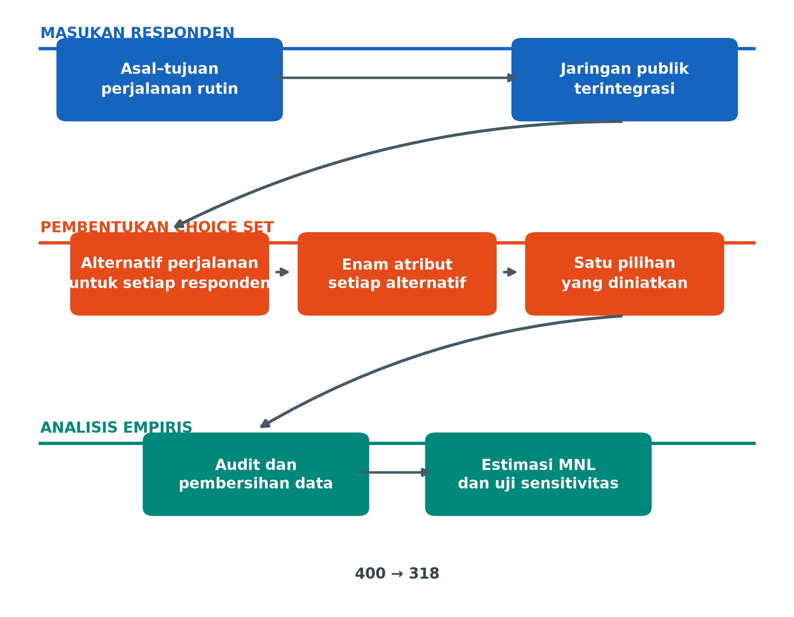
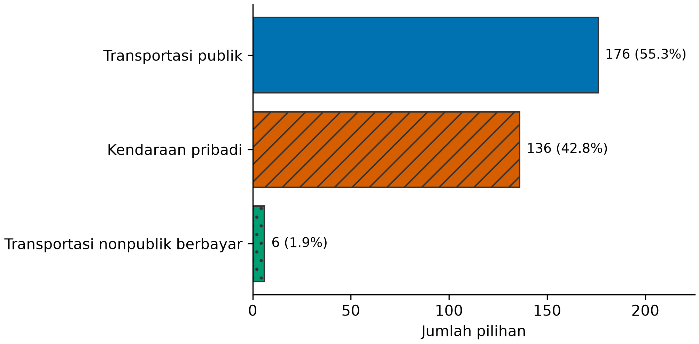
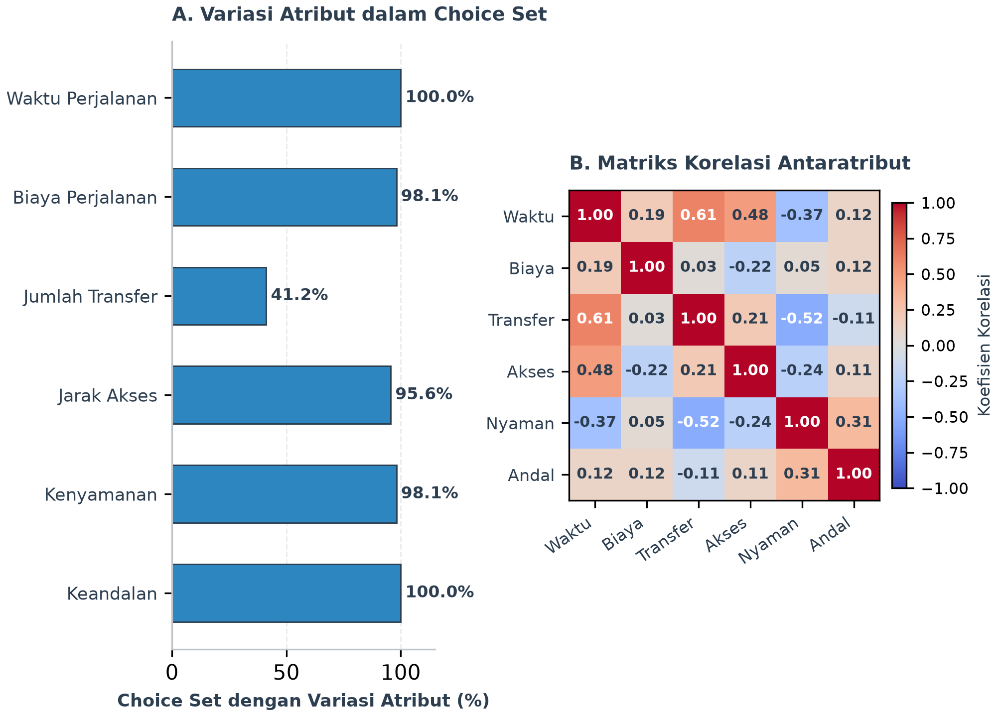
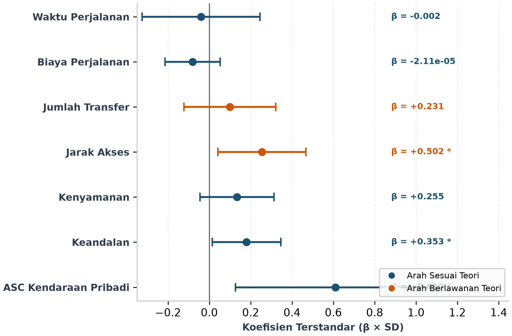
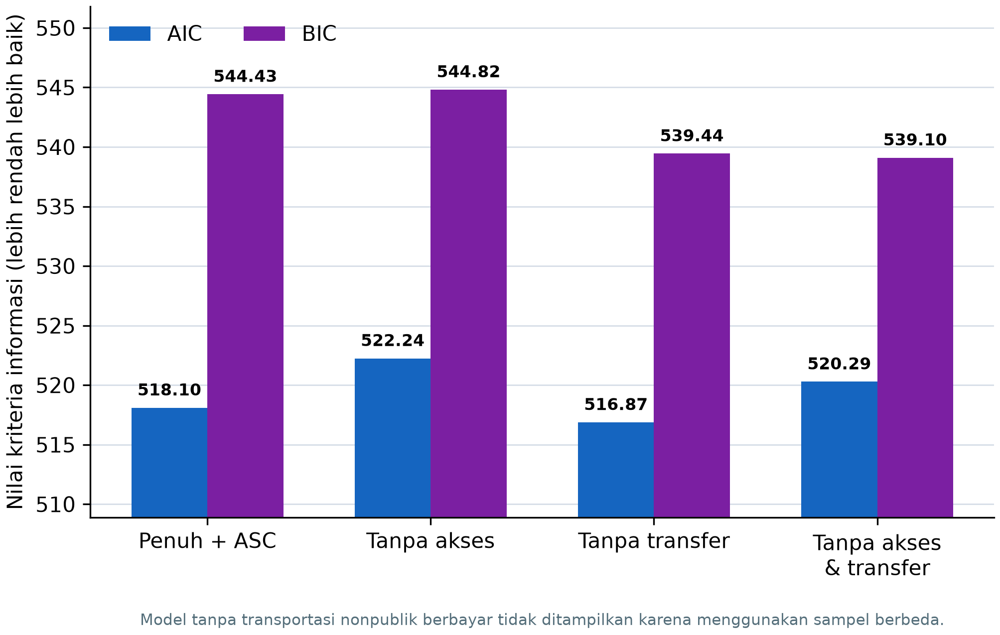
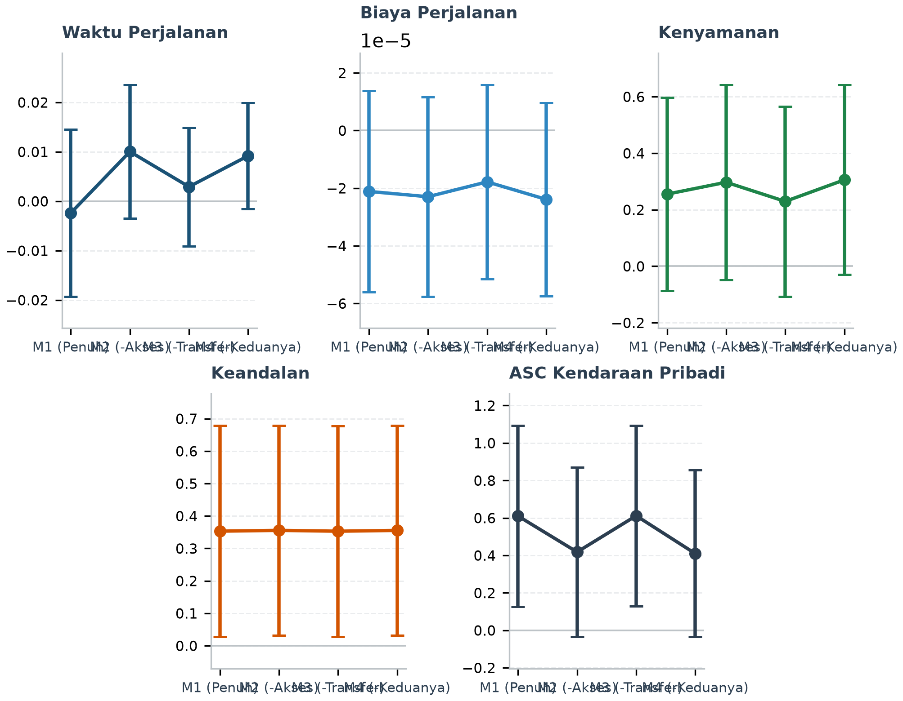

# Pemodelan Pemilihan Moda dalam Jaringan Transportasi Publik Terintegrasi di Kota Palembang Menggunakan Multinomial Logit

## ABSTRAK

Integrasi layanan tidak otomatis meningkatkan penggunaan transportasi publik apabila karakteristik alternatif yang dipertimbangkan pelaku perjalanan belum dipahami. Penelitian ini menganalisis pemilihan moda dalam jaringan LRT Sumsel, Teman Bus, dan Angkot Feeder di Kota Palembang menggunakan model logit multinomial. Survei dilaksanakan pada 1 Agustus–16 September 2026 terhadap 400 responden yang berdomisili dan rutin beraktivitas di Palembang serta mengetahui pilihan transportasi setempat. Setiap responden menentukan asal–tujuan perjalanan rutinnya; aplikasi kemudian membentuk alternatif transportasi publik, kendaraan pribadi, dan transportasi nonpublik berbayar dengan atribut waktu, biaya, transfer, jarak akses, kenyamanan, dan keandalan. Setelah audit, penggabungan alternatif identik, serta eksklusi pilihan tunggal dan nilai ekstrem, 318 observasi digunakan dalam estimasi. Model dengan konstanta spesifik alternatif kendaraan pribadi memberikan kecocokan lebih baik daripada model dasar (McFadden ρ² 0.0514; AIC 518.10). Keandalan berpengaruh positif dan signifikan (β=0.353; p<0.05), sedangkan konstanta kendaraan pribadi juga positif dan signifikan (β=0.610; p<0.05), yang menunjukkan kecenderungan dasar terhadap kendaraan pribadi di luar atribut terukur. Jarak akses bertanda positif dan signifikan tetapi berlawanan dengan ekspektasi teoritis sehingga tidak ditafsirkan secara kausal. Waktu, biaya, dan transfer tidak signifikan; penghapusan transfer tidak menurunkan kecocokan secara signifikan (p=0.3790). Hasil menegaskan pentingnya keandalan layanan dan faktor preferensi yang belum teramati, sekaligus menunjukkan bahwa parameter sistem dan pilihan yang diniatkan perlu divalidasi dengan data operasi serta perjalanan yang direalisasikan sebelum model digunakan untuk rekomendasi kebijakan atau personalisasi aplikasi.

**Kata kunci:** pemilihan moda; logit multinomial; transportasi publik terintegrasi; keandalan; Palembang

## PENDAHULUAN

Sistem transportasi publik perkotaan perlu menyediakan konektivitas dan kualitas layanan yang mampu bersaing dengan kendaraan pribadi. Di Kota Palembang, LRT Sumsel, Teman Bus, dan Angkot Feeder membentuk jaringan yang memungkinkan perjalanan antarmoda. Ketersediaan jaringan, bagaimanapun, belum menjelaskan bagaimana pengguna menilai waktu, biaya, perpindahan, akses, kenyamanan, dan keandalan ketika memilih moda. Analisis perilaku diperlukan agar investasi integrasi layanan tidak berhenti pada penyediaan infrastruktur.

Kerangka utilitas acak memodelkan pilihan sebagai hasil perbandingan utilitas alternatif (McFadden 1974; Ben-Akiva & Lerman 1985). Multinomial Logit (MNL) tetap menjadi landasan utama analisis pemilihan moda kontemporer karena menghubungkan probabilitas pilihan secara langsung dengan atribut perjalanan dan memungkinkan estimasi parameter melalui maximum likelihood (Train 2009; Zhao et al. 2020). Berbagai studi mutakhir menunjukkan bahwa waktu tempuh dan biaya merupakan disutilitas utama, sementara kualitas layanan, kenyamanan, dan keandalan operasional meningkatkan daya tarik angkutan umum secara signifikan (Eldeeb & Mohamed 2020; Ranjan & Sinha 2024). Di samping itu, kemudahan transfer dan jarak akses first-mile/last-mile terbukti menjadi faktor krusial yang menentukan apakah pengguna bersedia beralih dari kendaraan pribadi menuju sistem transit berbasis rel maupun bus pengumpan (Lu et al. 2023; Ramos-Santiago 2022; Lieu & Akar 2025).

Meskipun demikian, model logit multinomial dasar menghadapi tantangan dalam menangkap preferensi intrinsik yang belum teramati. Pilihan moda sering kali dipengaruhi oleh kebiasaan, ketersediaan moda, atau persepsi fleksibilitas yang tidak sepenuhnya terwakili oleh variabel tingkat layanan (Zhao et al. 2020; Ranjan & Sinha 2024). Oleh karena itu, penyertaan konstanta spesifik alternatif (alternative-specific constant/ASC) menjadi esensial untuk memisahkan preferensi bawaan terhadap moda tertentu dari pengaruh atribut perjalanan yang terukur (Ben-Akiva & Lerman 1985; Train 2009). Selain itu, penyusunan alternatif perjalanan yang realistis dan relevan dengan aktivitas rutin pelaku perjalanan menjadi kunci dalam menghasilkan model perilaku yang andal (Lu et al. 2023).

Penelitian ini menggunakan aplikasi pencarian rute sebagai instrumen pembentuk choice set untuk asal–tujuan rutin yang ditentukan sendiri oleh responden. Mesin Dijkstra (Dijkstra 1959) hanya berfungsi membangkitkan alternatif; kontribusi utama penelitian adalah estimasi determinan pemilihan moda. Tujuannya ialah: (1) mendeskripsikan pola pilihan antarkelompok moda; (2) mengestimasi MNL dasar dan MNL dengan alternative-specific constant (ASC) kendaraan pribadi; dan (3) menilai ketahanan hasil melalui spesifikasi tereduksi dan sensitivitas sampel.

## METODOLOGI

### Konteks Studi dan Jaringan Transportasi

Konteks studi adalah perjalanan rutin di Kota Palembang. Jaringan aplikasi mencakup delapan koridor Angkot Feeder, dua koridor Teman Bus, dan LRT Sumsel. Alternatif dikelompokkan menjadi transportasi publik, kendaraan pribadi, serta transportasi nonpublik berbayar. Kategori terakhir mencakup layanan berbasis permintaan atau sewaan di luar jaringan transportasi publik dan tidak disamakan dengan kendaraan pribadi.

### Pembentukan Choice Set oleh Aplikasi

Responden menentukan sendiri titik asal dan tujuan yang mewakili aktivitas rutinnya. Waktu keberangkatan ditetapkan otomatis sesuai waktu pengisian atau wawancara. Aplikasi menghubungkan titik tersebut dengan jaringan, menjalankan Dijkstra, menghitung segmen akses dan transfer, lalu menyajikan beberapa alternatif. Setiap alternatif membawa enam atribut yang sama. Responden memilih satu alternatif yang paling disukai sebelum perjalanan; realisasi setelah pilihan tidak diverifikasi.

GAMBAR 1. Alur pembentukan alternatif, pengumpulan pilihan, audit data, dan estimasi MNL

### Desain Survei dan Pengumpulan Data

Survei dilakukan 1 Agustus–16 September 2026 menggunakan non-probability convenience sampling. Kriteria inklusi ialah berdomisili dan rutin beraktivitas di Kota Palembang serta mengetahui pilihan transportasi di Palembang. Instrumen disampaikan melalui wawancara langsung kepada warga umum, jaringan mahasiswa, dan media sosial. Dalam wawancara, enumerator membacakan dan menjelaskan pertanyaan serta urutan alternatif yang sama seperti aplikasi secara netral tanpa menyarankan pilihan. Partisipasi bersifat sukarela, persetujuan diperoleh sebelum pengisian, dan data dicatat secara anonim.

### Variabel

TABEL 1. Definisi variabel model

| Variabel | Definisi dan satuan | Dugaan tanda |
|---|---|---:|
| Waktu | Total waktu perjalanan, menit | − |
| Biaya | Total biaya perjalanan, rupiah | − |
| Transfer | Jumlah pergantian kendaraan | − |
| Jarak akses | Jarak first/last-mile, km | − |
| Kenyamanan | Skor sistem 0–5 | + |
| Keandalan | Skor sistem 0–5 | + |
| ASC kendaraan pribadi | Indikator kendaraan pribadi | Tidak ditentukan |

Skor kenyamanan dan keandalan merupakan parameter sistem per moda, bukan pengukuran objektif lapangan. Karena itu, keduanya diperlakukan sebagai proksi dan dibahas sebagai keterbatasan.

TABEL 2. Karakteristik 318 responden dalam sampel analisis

| Karakteristik | Kategori dominan | n (%) |
|---|---|---:|
| Jenis kelamin | Perempuan | 157 (49.4) |
| Pekerjaan | Pelajar/mahasiswa | 204 (64.2) |
| Pendapatan | <Rp1 juta/bulan | 142 (44.7) |
| Kepemilikan kendaraan | Motor | 164 (51.6) |
| Tujuan perjalanan | Sekolah/kuliah | 164 (51.6) |
| Frekuensi angkutan umum | Beberapa kali seminggu | 116 (36.5) |

Delapan observasi tidak memiliki profil lengkap; persentase pada tabel menggunakan seluruh sampel analisis sebagai penyebut.

### Audit dan Pembersihan Data

CSV sumber memuat 400 observasi dari 400 responden unik. Alternatif dengan enam atribut identik dalam choice set digabung karena merepresentasikan perjalanan yang sama meskipun label antarmuka berbeda. Choice set dengan kurang dari dua alternatif unik dikeluarkan. Observasi juga dikeluarkan bila waktu melebihi 1,000 menit atau biaya melebihi Rp100,000, batas konservatif yang memisahkan kelompok anomali secara jelas dari distribusi lainnya. Setiap observasi final harus memiliki tepat satu pilihan.

TABEL 3. Alur pembentukan sampel analisis

| Tahap | Observasi |
|---|---:|
| Data sumber | 400 |
| Dikeluarkan: nilai ekstrem | 22 |
| Dikeluarkan: <2 alternatif unik | 60 |
| Sampel analisis final | 318 |

Sebanyak 136 baris alternatif duplikat digabung, menghasilkan 748 baris alternatif final. Checksum SHA-256 sumber adalah `93fcf7d061e8e294f2ebefd8dc8a52b7b5632484085b960e30820fc615219c2a`.

### Spesifikasi MNL

Utilitas alternatif $j$ bagi responden $i$ dirumuskan sebagai:

$$
U_{ij} = \beta_{\text{time}} \text{Time}_{ij} + \beta_{\text{cost}} \text{Cost}_{ij} + \beta_{\text{transfer}} \text{Transfer}_{ij} + \beta_{\text{access}} \text{Access}_{ij} + \beta_{\text{comfort}} \text{Comfort}_{ij} + \beta_{\text{reliability}} \text{Reliability}_{ij}
$$

Probabilitas model logit multinomial (MNL) dirumuskan sebagai:

$$
P_{ij} = \frac{\exp(U_{ij})}{\sum_{m} \exp(U_{im})}
$$

Model utama menambahkan $\alpha_{\text{private}} I(\text{private})_{ij}$, dengan transportasi publik sebagai kategori acuan. Parameter diestimasi menggunakan Newton–Raphson. Inferensi utama menggunakan standard error biasa karena setiap UUID final hanya menyumbang satu observasi. Kecocokan dinilai melalui log-likelihood, McFadden $\rho^2$, AIC, dan BIC.

### Analisis Sensitivitas

Model utama dibandingkan dengan model tanpa jarak akses, tanpa transfer, tanpa keduanya, dan tanpa transportasi nonpublik berbayar. Likelihood-ratio test hanya digunakan untuk model tersarang dengan sampel sama. Model sensitivitas sampel tidak dibandingkan langsung menggunakan AIC/BIC dengan model sampel penuh.

## HASIL DAN PEMBAHASAN

### Sampel Analisis dan Pola Pilihan

Dari 318 pilihan final, 176 (55.3%) memilih transportasi publik, 136 (42.8%) kendaraan pribadi, dan 6 (1.9%) transportasi nonpublik berbayar. Distribusi ini menunjukkan bahwa pilihan publik merupakan mayoritas tipis, sementara kendaraan pribadi tetap kompetitif meskipun choice set dibentuk dalam konteks jaringan publik terintegrasi.

GAMBAR 2. Distribusi pilihan berdasarkan kelompok moda

### Variasi dan Korelasi Atribut

Waktu dan keandalan bervariasi pada seluruh choice set; biaya dan kenyamanan pada 98.1%, jarak akses pada 95.6%, sedangkan transfer hanya pada 41.2%. Keterbatasan variasi transfer mengurangi informasi untuk mengidentifikasi parameternya. Korelasi waktu–transfer sebesar 0.606 dan transfer–kenyamanan sebesar −0.521 juga menunjukkan bahwa sebagian pengaruh atribut sulit dipisahkan.

GAMBAR 3. Variasi dalam choice set (Panel A) dan korelasi atribut (Panel B)

### Hasil Estimasi MNL

TABEL 4. Estimasi model dasar dan model dengan ASC kendaraan pribadi

| Variabel | Model dasar β (SE) | MNL+ASC β (SE) |
|---|---:|---:|
| Waktu | −0.00693 (0.00841) | −0.00239 (0.00861) |
| Biaya | −0.0000225 (0.0000174) | −0.0000211 (0.0000179) |
| Transfer | 0.240 (0.258) | 0.231 (0.263) |
| Jarak akses | 0.336 (0.194) | 0.502** (0.214) |
| Kenyamanan | 0.413** (0.164) | 0.255 (0.174) |
| Keandalan | 0.118 (0.132) | 0.353** (0.166) |
| ASC kendaraan pribadi | — | 0.610** (0.247) |
| Log-likelihood | −255.166 | −252.049 |
| McFadden ρ² | 0.0397 | 0.0514 |
| AIC | 522.33 | 518.10 |
| BIC | 544.91 | 544.43 |

**Catatan:** ** signifikan pada 5% (|t|>1.96); SE biasa dalam tanda kurung.

ASC meningkatkan log-likelihood dan menurunkan AIC, walaupun peningkatan ρ² dari 0.0397 menjadi 0.0514 tetap menunjukkan daya jelas rendah. Nilai kecocokan yang moderat ini sejalan dengan temuan studi pemilihan moda perkotaan kontemporer yang menunjukkan bahwa model logit multinomial berbasis atribut tingkat layanan murni sering kali memiliki keterbatasan dalam menjelaskan variasi pilihan individual tanpa menyertakan variabel sikap atau persepsi laten (Zhao et al. 2020; Eldeeb & Mohamed 2020). ASC kendaraan pribadi positif dan signifikan (β=0.610; p<0.05), yang membuktikan adanya preferensi intrinsik terhadap kendaraan pribadi yang kuat di luar atribut waktu dan biaya perjalanan (Ranjan & Sinha 2024). Sementara itu, keandalan berpengaruh positif dan signifikan (β=0.353; p<0.05), menegaskan bahwa kepastian kedatangan armada merupakan determinan krusial dalam keputusan menggunakan angkutan umum (Eldeeb & Mohamed 2020). Waktu dan biaya bertanda negatif sesuai ekspektasi teoritis namun tidak signifikan secara statistik.

Jarak akses bertanda positif dan signifikan secara statistik, berlawanan dengan ekspektasi teoritis standar disutilitas perjalanan kaki. Fenomena ini perlu dimaknai secara hati-hati dalam konteks integrasi first-mile/last-mile perkotaan: nilai akses nol pada kendaraan pribadi, perbedaan jangkauan spasial koridor pengumpan (feeder), serta ketergantungan pada proksi jaringan dapat menyebabkan parameter akses menyerap efek struktur spasial atau ketersediaan moda di lokasi asal responden (Lu et al. 2023; Ramos-Santiago 2022; Lieu & Akar 2025). Oleh karena itu, koefisien akses ini tidak ditafsirkan bahwa pelaku perjalanan menyukai jarak jalan kaki yang lebih jauh, melainkan mencerminkan kompleksitas keterjangkauan halte transit di lapangan (Lieu & Akar 2025). Kenyamanan kehilangan signifikansi setelah ASC disertakan, yang mengindikasikan bahwa atribut kenyamanan sistemik beririsan erat dengan identitas moda kendaraan pribadi.

GAMBAR 4. Koefisien model MNL+ASC dan interval kepercayaan 95%

### Sensitivitas dan Pemilihan Model

TABEL 5. Analisis sensitivitas spesifikasi

| Spesifikasi | LL | ρ² | AIC | BIC | LR p-value |
|---|---:|---:|---:|---:|---:|
| Penuh + ASC | −252.049 | 0.0514 | 518.10 | 544.43 | — |
| Tanpa akses | −255.122 | 0.0399 | 522.24 | 544.82 | 0.0132 |
| Tanpa transfer | −252.436 | 0.0500 | 516.87 | 539.44 | 0.3790 |
| Tanpa akses & transfer | −255.143 | 0.0398 | 520.29 | 539.10 | 0.0453 |
| Tanpa transportasi nonpublik berbayar† | −237.397 | 0.0404 | 488.79 | 514.67 | — |

**Catatan:** †N=298 sehingga AIC/BIC tidak dibandingkan langsung dengan model N=318.

Penghapusan akses menurunkan kecocokan secara signifikan (p=0.0132), sehingga akses tetap membawa informasi meskipun tandanya bermasalah. Penghapusan transfer tidak signifikan (p=0.3790) dan menghasilkan AIC lebih rendah; model tanpa transfer layak sebagai robustness check, tetapi model penuh dipertahankan sebagai model utama berdasarkan kerangka konseptual.

GAMBAR 5. AIC dan BIC untuk model dengan sampel yang sama

Tanda kenyamanan, keandalan, dan ASC tetap positif dalam seluruh spesifikasi. Sebaliknya, tanda waktu dan biaya berubah pada beberapa uji sensitivitas. Ketidakstabilan ini membatasi interpretasi value of time dan menunjukkan bahwa enam atribut belum sepenuhnya memisahkan mekanisme pilihan.

GAMBAR 6. Stabilitas koefisien relatif terhadap model penuh

### Implikasi dan Keterbatasan

Hasil mendukung prioritas pada keandalan: jadwal yang lebih dapat diprediksi dan kepastian operasional armada berpotensi memperkuat daya saing transportasi publik secara signifikan (Eldeeb & Mohamed 2020; Ranjan & Sinha 2024). Nilai ASC kendaraan pribadi yang positif dan signifikan mengindikasikan bahwa persepsi kenyamanan pribadi, fleksibilitas, kebiasaan berkendara, atau ketersediaan kendaraan bermotor masih menjadi penghambat utama peralihan moda menuju angkutan massal (Ranjan & Sinha 2024; Zhao et al. 2020). Selain itu, temuan mengenai transfer dan akses menegaskan pentingnya perbaikan konektivitas fisik dan fasilitas pejalan kaki di sekitar halte pengumpan dan stasiun LRT guna meminimalkan hambatan pergantian moda (Ramos-Santiago 2022; Lu et al. 2023). Kebijakan pengelolaan transportasi perkotaan di Palembang sebaiknya tidak hanya bertumpu pada intervensi tarif atau pemangkasan waktu tempuh di dalam kendaraan, melainkan memprioritaskan pengurangan ketidakpastian kedatangan armada dan peningkatan kualitas akses lingkungan transit (Lieu & Akar 2025).

Interpretasi dibatasi oleh convenience sampling, pilihan yang belum diverifikasi realisasinya, dua mode pengumpulan, serta parameter kenyamanan, keandalan, headway, dan kecepatan yang sebagian berbasis asumsi sistem. MNL juga membawa asumsi independence of irrelevant alternatives (Train 2009). Daya jelas rendah dan tanda akses yang tidak sesuai teori menunjukkan perlunya data operasi aktual, pengukuran akses yang lebih kaya, variabel sikap, serta model heterogenitas pada penelitian selanjutnya (Zhao et al. 2020; Eldeeb & Mohamed 2020).

## KESIMPULAN

Penelitian ini menghubungkan choice set perjalanan rutin yang dibentuk aplikasi dengan MNL untuk menganalisis pemilihan moda di jaringan publik terintegrasi Palembang. Dari 400 responden, 318 observasi memenuhi aturan kualitas. Model MNL+ASC lebih baik daripada model dasar, tetapi daya jelasnya tetap rendah. Keandalan dan kecenderungan dasar terhadap kendaraan pribadi signifikan dan stabil, sedangkan waktu, biaya, serta transfer belum signifikan. Akses membawa informasi statistik tetapi bertanda berlawanan dengan teori sehingga tidak boleh diberi interpretasi perilaku langsung.

Temuan mengarahkan perbaikan layanan pada keandalan dan faktor tak teramati yang mempertahankan kendaraan pribadi. Model tanpa transfer mendukung ketahanan sebagian hasil, tetapi perubahan tanda waktu dan biaya menuntut kehati-hatian. Koefisien belum digunakan untuk rekomendasi produksi. Validasi berikutnya perlu menggabungkan waktu operasi aktual, realisasi perjalanan, pengukuran persepsi yang tervalidasi, dan rancangan sampel yang lebih representatif.

## PENGHARGAAN

Penelitian ini didukung oleh `[NAMA PEMBERI DANA]` melalui hibah nomor `[NOMOR HIBAH]`.

## PERNYATAAN KEPENTINGAN BERSAING

Tidak ada.

## REFERENSI

Badan Pusat Statistik Kota Palembang. 2024. *Kota Palembang dalam Angka 2024*. Palembang: BPS Kota Palembang.

Ben-Akiva, M. & Lerman, S.R. 1985. *Discrete Choice Analysis: Theory and Application to Travel Demand*. Cambridge, MA: MIT Press.

Dijkstra, E.W. 1959. A note on two problems in connexion with graphs. *Numerische Mathematik* 1: 269–271. https://doi.org/10.1007/BF01386390

Direktorat Jenderal Perkeretaapian. 2023. *Profil Pengoperasian LRT Sumatera Selatan*. Jakarta: Kementerian Perhubungan Republik Indonesia.

Eldeeb, G. & Mohamed, M. 2020. Quantifying preference heterogeneity in transit service desired quality using a latent class choice model. *Transportation Research Part A: Policy and Practice* 139: 119–133. https://doi.org/10.1016/j.tra.2020.07.006

Lieu, S. & Akar, G. 2025. Understanding rail users' mode choice behavior for first and last mile travel. *Journal of Transport Geography* 125: 104214. https://doi.org/10.1016/j.jtrangeo.2025.104214

Lu, Y., Prato, C.G. & Sipe, N. 2023. Understanding the role of household modality style on first and last mile travel mode choice and public transit station choice. *Travel Behaviour and Society* 32: 100580. https://doi.org/10.1016/j.tbs.2023.100580

McFadden, D. 1974. Conditional logit analysis of qualitative choice behavior. In *Frontiers in Econometrics*, edited by P. Zarembka, 105–142. New York: Academic Press.

Ramos-Santiago, L. 2022. Does walkability around feeder bus-stops influence rapid-transit station boardings? *Journal of Public Transportation* 24: 100026. https://doi.org/10.1016/j.jpubtr.2022.100026

Ranjan, R. & Sinha, S. 2024. Mode choice analysis for work trips of urban residents using multinomial logit model. *Innovative Infrastructure Solutions* 9(5): 181. https://doi.org/10.1007/s41062-024-01681-5

Train, K.E. 2009. *Discrete Choice Methods with Simulation*. 2nd ed. Cambridge: Cambridge University Press.

Zhao, X., Yan, X., Yu, A. & Van Hentenryck, P. 2020. Prediction and behavioral analysis of travel mode choice: A comparison of machine learning and logit models. *Travel Behaviour and Society* 20: 22–35. https://doi.org/10.1016/j.tbs.2020.02.003
